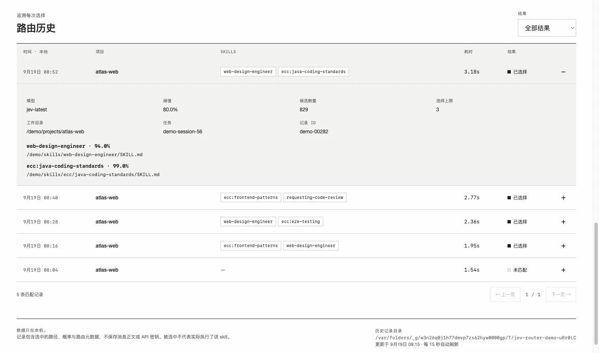

# Jev Skill Router for Codex

[English](README.md) | **简体中文**

## 功能

- **Jev skill 选择**：评估符合条件的 skills，将选中的名称、路径和相关性概率交给 Codex。
- **本地选择记录**：记录已选择、未匹配、无候选项和路由失败，以及对应项目、任务、模型、阈值与耗时。
- **Web 统计页面**：查看选择率、每日趋势、skill 排行、平均相关性和可展开的记录详情，支持时间、项目、skill 与结果筛选。
- **中英文界面**：支持语言切换、明暗主题和手机浏览。
- **打开应用即启动 Web**：macOS 注册一次随附的启动服务后，打开 Codex 就会启动 Web，无需进入任务或发送消息；端口读取 Jev 配置文件。

### 页面预览

以下截图使用**演示数据**，不代表 Jev 实测准确率或真实用户历史。视觉风格参考 [TypeSafe AI](https://typesafe.ai/)。


<details>
<summary>查看单次路由决策详情</summary>



</details>

## 运行要求

- 支持插件 hooks、`SessionStart`、`UserPromptSubmit` 和 app-server `skills/list` 的 Codex CLI；开发基于 **0.154.0**。
- Codex 进程能够找到 **Node.js 22+**。
- 具有 Jev 访问权限的 TypeSafe API Key。

仓库已包含打包后的 hook，使用时**不需要** `npm install`、Python 或 MCP 服务。随应用启动使用插件随附的 macOS 用户级 LaunchAgent；其他平台仍支持随任务／消息启动。

## 安装

```sh
codex plugin marketplace add https://github.com/droid-Q/jev-skill-router.git
codex plugin add jev-skill-router@jev-skill-router
```

按下文配置密钥。在 Codex CLI 中打开 `/hooks`，审查并信任该插件的 `SessionStart` 和 `UserPromptSubmit` 命令。安装插件不会自动信任其 hooks。桌面端与 CLI 需要使用同一份本机 Codex 配置。如需打开应用就启动 Web，再按下文注册一次 macOS 启动服务。

## 配置

在启动 Codex 的环境中设置 `TYPESAFE_API_KEY`，或创建 `~/.config/jev-skill-router/config.json`：

```json
{
  "apiKey": "YOUR_TYPESAFE_API_KEY",
  "model": "jev-latest",
  "threshold": 0.8,
  "maxSkills": 3,
  "timeoutMs": 12000,
  "codexBin": "codex",
  "recordSelections": true,
  "dashboardAutoStart": true,
  "dashboardPort": 4318
}
```

将配置文件放在仓库之外，并限制访问权限：

```sh
chmod 600 ~/.config/jev-skill-router/config.json
```

桌面端建议使用配置文件：从 Finder 启动的应用可能不会继承终端环境变量。如果通过环境变量提供密钥，可以不创建配置文件；但显式指定一个不存在的配置文件会报错。

| 配置项 | 默认值 | 含义 |
| --- | --- | --- |
| `apiKey` | 空 | 密钥；`TYPESAFE_API_KEY` 环境变量优先。 |
| `model` | `jev-latest` | Jev 模型别名或固定版本标识。 |
| `threshold` | `0.8` | 最低相关性概率，必须大于 `0.5` 且不大于 `1`。 |
| `maxSkills` | `3` | 最多选择的可选 skills 数量，范围 `1`～`20`。 |
| `timeoutMs` | `12000` | skill 发现和 API 调用共用的总超时，范围 `100`～`20000` 毫秒。 |
| `codexBin` | `codex` | 可执行程序名或绝对路径，不包含 shell 参数；`JEV_CODEX_BIN` 优先。 |
| `recordSelections` | `true` | 是否在本机保存路由历史；设为 `false` 停止新增记录，已有记录保留。 |
| `dashboardAutoStart` | `true` | 由 macOS 启动服务和任务／消息 hook 自动启动 Web；设为 `false` 后仍可手动启动。 |
| `dashboardPort` | `4318` | 在此 Jev JSON 文件中配置 Web 端口，范围 `1`～`65535`，也是手动启动的默认端口。 |
| `dataDir` | `~/.local/share/jev-skill-router` | 历史目录；自定义值必须是**绝对路径**，JSON 中不会展开 `~`；`JEV_SKILL_ROUTER_DATA_DIR` 优先。 |

通过 `JEV_SKILL_ROUTER_CONFIG` 指定其他配置文件，或设置 `JEV_SKILL_ROUTER_DISABLED=1` 停用选择功能和 hook 自动启动 Web 服务的行为。插件不会自行写入配置或保存用户消息。

## Web 页面与历史记录

### 打开 Codex 时启动（macOS）

注册一次启动服务，插件根目录使用 `codex plugin add` 输出或 `/hooks` 显示的实际路径：

```sh
node "<已安装插件根目录>/scripts/router.mjs" --install-app-startup
```

在仓库目录下也可执行 `npm run autostart:install`，无需管理员权限或安装额外依赖。

之后打开 Codex 桌面应用，约五秒内就会启动 Web，即使停留在首页、尚未进入任务也可以使用。启动服务通过原生应用标识 `com.openai.codex` 检测，兼容当前以 ChatGPT 命名、内含 Codex 的桌面版本。它只在当前 macOS 用户登录期间运行，不发送消息，也不调用 Jev。插件不会自动弹出浏览器标签页。

默认页面为 [http://127.0.0.1:4318](http://127.0.0.1:4318)。**端口配置在 `~/.config/jev-skill-router/config.json` 的 `dashboardPort` 中**，LaunchAgent 不保存端口。修改后下次检查即读取新配置；原端口上的已运行服务会等待空闲超时退出。将 `dashboardAutoStart` 设为 `false` 可停止后续自动启动。

服务注册文件为 `~/Library/LaunchAgents/io.github.droid-q.jev-skill-router.plist`，独立脚本复制到 `~/Library/Application Support/Jev Skill Router/router.mjs`，避免插件旧版本缓存被清理后失效。注册时设置的 `JEV_SKILL_ROUTER_CONFIG`、`JEV_SKILL_ROUTER_DATA_DIR`、`JEV_SKILL_ROUTER_DISABLED` 会传给启动服务；API Key 不会写入服务注册文件。

**卸载插件前**先移除随应用启动的服务；也可在仓库执行 `npm run autostart:remove`：

```sh
node "<已安装插件根目录>/scripts/router.mjs" --remove-app-startup
```

该命令仅删除启动服务注册文件及复制的脚本，保留 Jev 配置与选择历史。如果已经卸载插件，可以对 `"$HOME/Library/Application Support/Jev Skill Router/router.mjs"` 使用同样的参数。

`SessionStart` 和 `UserPromptSubmit` 继续作为补充机制，无需 macOS 启动服务也可使用，分别在启动／恢复任务、提交消息时启动 Web。Codex 没有应用启动级插件 hook，因此进入任务之前的自动启动需要上述 macOS 服务。

多个任务共用一个服务。hook 仅复用历史目录相同的 Jev 页面，不会为抢占端口停止其他进程。若端口已占用，将 `dashboardPort` 改为可用端口即可。启动失败只显示简短状态，不影响 skill 选择。页面服务本身不需要 Jev 密钥。

自动启动的进程在连续 30 分钟没有页面请求、启动服务检查或 hook 检查后退出。Codex 打开期间，启动服务会保持页面可用，并在进程停止后恢复。退出 Codex 并关闭页面后，服务会在空闲超时后退出；停用或移除自动启动时，已运行服务也会等待空闲超时。可见页面的定时刷新会使服务保持运行，历史记录保留在磁盘上。

如需手动启动，将 `dashboardAutoStart` 设为 `false`，在仓库目录下使用 Node.js 22+ 执行：

```sh
npm run dashboard
```

该命令直接使用已提交的打包脚本，查看页面无需 `npm install`。手动启动时可覆盖配置中的端口：

```sh
npm run dashboard -- --port 4320
```

也可用 Node.js 执行已安装插件的 `scripts/router.mjs --dashboard`。插件根目录以 `/hooks` 显示的实际路径为准，版本更新会改变缓存目录。页面进程与 hook 需要使用同一份配置和历史目录。页面服务只读，仅监听 `127.0.0.1`，不加载外部资源，也不请求 Jev。手动启动的服务需要保持终端运行，按 `Ctrl+C` 停止；自动启动的服务无需保持终端。

概览提供今天／最近 7／30／90 天与项目筛选，展示选择次数、选择命中率、选中过的 skill 数量、平均耗时和每日结果柱状图。排行展示每个 skill 的选中次数、选择率、平均相关性概率及最近选中时间。点击 skill 可筛选记录，展开记录可查看完整路径、概率、候选数量、模型、阈值、任务 ID 和安全错误码。历史支持分页。页面可见且空闲时每 15 秒刷新；聚焦控件或展开详情期间暂停自动刷新。

**统计口径：**“成功评估”指结果为 `selected` 或 `none` 的请求。概览命中率为至少选中一个 skill 的请求数除以成功评估数；单个 skill 的选择率为它的选中次数除以相同时间／项目范围内的成功评估数。搜索和结果筛选只影响列表，不改变统计分母。一次请求可选中多个 skills，因此各 skill 的选择率之和不一定是 100%。平均相关性只统计被选中的次数；失败与无候选项单独显示。平均耗时包含所有已记录路由尝试，不包含日志写入耗时。日期按 UTC 分组，单条时间使用浏览器本地时区。

Skills 按解析后的 `SKILL.md` 完整路径区分；不同路径或已安装版本会分别统计。

这些数据是**选择统计**，不能证明 Codex 实际执行了某个 skill。安装记录功能之前的历史请求无法补录。

记录按天追加到 `~/.local/share/jev-skill-router/YYYY-MM-DD.jsonl`。支持相应权限的系统中，新目录使用 `0700`，新文件使用 `0600`。每条记录保存时间、生成的 ID、工作目录、可选任务 ID、路由配置、候选数量、耗时、结果、选中的名称／路径／概率和经过清理的错误码；**不保存**用户消息正文、对话记录、skill 正文、API Key 或原始接口错误。停用路由、仅查询目录的 `--list` 调用、无效配置及无效 hook 输入不会生成选择记录。历史写入失败不影响路由；路由本身成功时会显示简短的记录失败提示。

日志不会自动删除。页面最多查看 90 天；单次查询超过 64 MiB 时会提示缩短范围或归档旧的每日文件。损坏或不完整的行会被跳过，并显示数量。关闭 Web 页面不会停止 hook 记录。

无需密钥或真实历史即可复现文档中的演示页面：

```sh
npm run dashboard:demo
```

打开 [http://127.0.0.1:4319](http://127.0.0.1:4319)。演示记录在独立临时目录生成，页面明确标记为**演示数据**，按 `Ctrl+C` 后清理该目录。演示不会读取 API 配置，也不会请求 Codex/Jev。可用 `npm run dashboard:demo -- 4321` 指定端口。

### 更新已有安装

```sh
codex plugin marketplace upgrade jev-skill-router
codex plugin add jev-skill-router@jev-skill-router
```

若 `/hooks` 提示，审查并信任更新后的 hooks。如已启用 macOS 随应用启动，使用**升级后的已安装脚本**再执行一次 `--install-app-startup`，以更新复制的脚本；Node.js 路径变更后也需重新注册。从手动启动页面的旧版本升级时，先在原终端按 `Ctrl+C` 停止旧进程，以便自动启动使用该端口。历史记录位于插件缓存之外，升级时会保留。

## 工作方式

- 根据 hook 的工作目录查询 Codex 实际加载的 skill 目录，包含启用的插件，不扫描插件缓存中的历史版本。
- 排除禁用、文件缺失、配置无效及禁止隐式调用的 skills（`agents/openai.yaml` 中 `policy.allow_implicit_invocation: false`），并通过真实文件路径去除符号链接别名。
- 为每个候选项提交独立的 [Noul 问题](https://docs.typesafe.ai/primitives/noul)。Noul 表示相关性概率，**不是**额外的 confidence 分数；可选择多个 skills，也不受 Choice 单题最多 255 个选项的限制。
- 将全部候选项分批发送，最多同时请求三批。使用保守的 UTF-8 字节限制控制 Jev 上下文大小，不预先按关键词截取前几个候选项。
- 从达到阈值的候选项中按概率选取；全部未达到阈值时，不增加可选 skills。
- 保留用户明确指定的 skills、更高优先级的要求，以及当前任务已经需要的 skills。选择结果不会扩大工具执行或其他操作权限。
- 缺少密钥、接口错误、限流、超时、输入过大或响应无效时，保留 Codex 原有选择流程并显示简短状态信息。任意批次失败都不会注入不完整的选择结果；hook 内不自动重试。

只评估最新提交的消息，不读取此前的对话记录。过短的跟进消息可能缺少足够的推荐上下文。独立的目录查询进程使用已保存的 Codex 配置，不会继承仅当前任务持有的额外 skill 根目录或尚未保存的配置覆盖。

## 发送给 TypeSafe 的数据

当前消息及候选 skill 的名称、描述会发送到 `https://api.typesafe.ai/v1/systemone`。插件不读取完整 skill 正文或历史对话，目录中的路径字段保留在本机。消息或描述中原本包含的敏感文字仍会发送，因此应在适合由你的 TypeSafe 账户处理的任务中启用。

密钥只通过 API 认证请求头发送，拒绝 HTTP 重定向。错误输出不包含密钥、用户消息、服务端响应正文或 app-server 日志。

## 本地开发与验证

```sh
git clone git@github.com:droid-Q/jev-skill-router.git
cd jev-skill-router
npm ci
npm run build
npm test
npm run skills
```

`npm run skills` 列出可选候选项及密钥是否配置，**不会请求 Jev**。源码使用 Node.js 原生网络及进程接口，并用 `yaml` 正确解析 skill 策略。`esbuild` 生成已经纳入版本管理的独立脚本；修改源码后需重新打包并一并提交。

配置密钥后，在仓库根目录执行以下命令，可以验证真实 Jev 调用：

```sh
node -e 'process.stdout.write(JSON.stringify({hook_event_name:"UserPromptSubmit",cwd:process.cwd(),prompt:"Review the JavaScript code and its tests."}))' \
  | node plugins/jev-skill-router/scripts/router.mjs
```

这会将示例消息和本机符合条件的 skill 元数据发送给 TypeSafe。成功时返回 `hookSpecificOutput.additionalContext`，降级时返回 `systemMessage`。hook 降级时仍以成功状态退出，让原任务继续进行。

自检使用合成 Jev 响应和临时文件，覆盖 app-server 协议、策略过滤、链接去重、打包后 CLI、请求结构、多 skill 选择、分批、无效响应、超时、安全降级、私密与并发记录、历史筛选、统计分母、分页及本地 HTTP 访问限制；同时验证脱离终端启动、并发 hooks、服务复用、停止后恢复、关闭自动启动、空闲退出、端口冲突处理、应用打开／关闭行为、读取 Jev 配置中的端口变更及不含 API Key 的 LaunchAgent XML。HTTP 检查需要允许监听临时本地端口。它**不代表** Jev 选择准确率评测或真实 API 访问验证。

## 参考资料

- [Codex hooks](https://developers.openai.com/codex/hooks)
- [插件打包与 hook 发现](https://developers.openai.com/plugins/build/plugins)
- [TypeSafe HTTP API](https://docs.typesafe.ai/api)
- [Jev 模型限制](https://docs.typesafe.ai/models)
