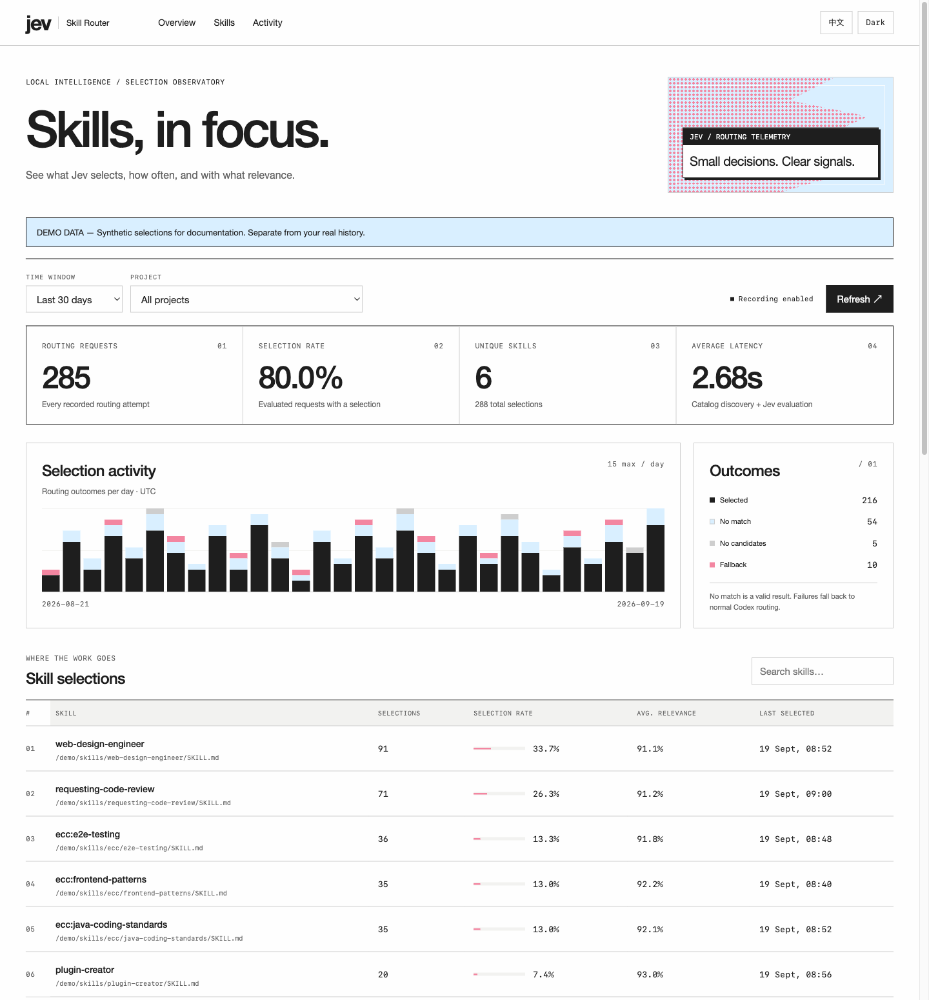
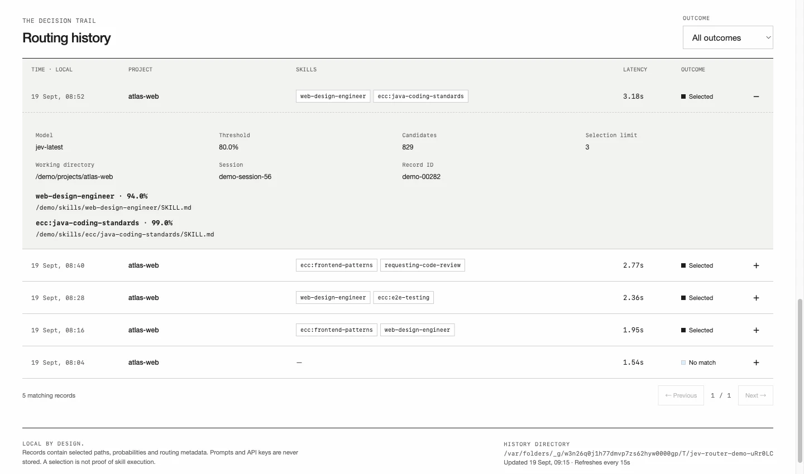

# Jev Skill Router for Codex

**English** | [简体中文](README-cn.md)

## Features

- **Jev skill routing** — evaluate eligible skills and pass the selected names, paths, and relevance probabilities to Codex.
- **Local selection history** — record selections, no matches, empty catalogs, and routing failures, together with project, session, model, threshold, and latency.
- **Web analytics** — inspect selection rates, daily trends, skill rankings, average relevance, and expandable records. Filter by time, project, skill, or outcome.
- **English / Chinese UI** — switch language and light/dark appearance; the dashboard also works on mobile.
- **No extra service required for recording** — history is written by the hook. Start the dashboard only when you want to inspect it.

### Dashboard preview

The screenshots below use **synthetic demo data**, not measured Jev accuracy or real user history. The visual style takes inspiration from [TypeSafe AI](https://typesafe.ai/).



<details>
<summary>Inspect an individual routing decision</summary>



</details>

## Requirements

- Codex CLI with plugin hooks, `UserPromptSubmit`, and app-server `skills/list`. Developed against **0.154.0**.
- **Node.js 22+** available to the process running Codex.
- A TypeSafe API key with access to Jev.

The shipped hook is bundled. Plugin users do **not** need `npm install`, Python, an MCP server, or a separate background service.

## Install

```sh
codex plugin marketplace add https://github.com/droid-Q/jev-skill-router.git
codex plugin add jev-skill-router@jev-skill-router
```

Configure the key as described below. Open `/hooks` in the Codex CLI and review/trust this plugin's `UserPromptSubmit` command. Installing a plugin does not automatically trust its hooks. Start a new Codex task after installation; the desktop app and CLI must use the same local Codex configuration.

## Configure

Set `TYPESAFE_API_KEY` in the environment that starts Codex, or create `~/.config/jev-skill-router/config.json`:

```json
{
  "apiKey": "YOUR_TYPESAFE_API_KEY",
  "model": "jev-latest",
  "threshold": 0.8,
  "maxSkills": 3,
  "timeoutMs": 12000,
  "codexBin": "codex",
  "recordSelections": true
}
```

Keep this file outside the repository and restrict its permissions:

```sh
chmod 600 ~/.config/jev-skill-router/config.json
```

For the desktop app, prefer the configuration file: apps launched from Finder may not inherit terminal environment variables. The file is optional when the API key is supplied through the environment. An explicitly specified, missing configuration file is an error.

| Setting | Default | Meaning |
| --- | --- | --- |
| `apiKey` | empty | Overridden by `TYPESAFE_API_KEY`. |
| `model` | `jev-latest` | Jev model or versioned Jev identifier. |
| `threshold` | `0.8` | Minimum relevance probability; must be greater than `0.5` and at most `1`. |
| `maxSkills` | `3` | Maximum optional selections, from `1` to `20`. |
| `timeoutMs` | `12000` | Shared discovery/API deadline, from `100` to `20000` milliseconds. |
| `codexBin` | `codex` | Executable name or absolute path; no shell arguments. Overridden by `JEV_CODEX_BIN`. |
| `recordSelections` | `true` | Save routing history locally. `false` stops new records without deleting existing history. |
| `dataDir` | `~/.local/share/jev-skill-router` | History directory. A custom value must be an **absolute path** (`~` is not expanded in JSON). Overridden by `JEV_SKILL_ROUTER_DATA_DIR`. |

Set `JEV_SKILL_ROUTER_CONFIG` to use another configuration file, or `JEV_SKILL_ROUTER_DISABLED=1` to disable routing. The plugin does not write settings or store prompts.

## Web dashboard and history

From the repository checkout, with Node.js 22+:

```sh
npm run dashboard
```

Open [http://127.0.0.1:4318](http://127.0.0.1:4318). This uses the committed bundle, so `npm install` is unnecessary for viewing the dashboard. To choose another port:

```sh
npm run dashboard -- --port 4320
```

You can also run the installed plugin's `scripts/router.mjs --dashboard` with Node.js. Use the exact plugin root shown in `/hooks`; cache directories change between plugin versions. The dashboard and hook must use the same config and data directory. The dashboard is read-only, listens only on `127.0.0.1`, loads no external assets, and makes no calls to Jev. Keep its terminal open while viewing it; stop with `Ctrl+C`.

The overview offers today / 7 / 30 / 90-day windows, project filters, selection counts, selection rate, distinct selected skills, average latency, and daily outcome bars. Rankings show each skill's selection count, rate, mean relevance probability, and most recent selection. Click a skill to filter records, or expand a record to see exact paths, probabilities, candidate count, model, threshold, session, and a safe error code. History is paginated. The page refreshes every 15 seconds while visible and idle; refresh pauses during focused controls or expanded-record inspection.

**Metric definitions:** a successfully evaluated request has outcome `selected` or `none`. The overview selection rate is requests with at least one selected skill divided by successfully evaluated requests. A skill's rate is its selection count divided by the same denominator within the time/project filters. Search and outcome filters affect the lists, not that denominator. Several skills can be selected in one request, so skill rates need not sum to 100%. Average relevance includes only selected occurrences. Failed evaluations and empty catalogs are shown separately. Average latency includes all recorded routing attempts and excludes the history write itself. Dates are grouped by UTC; individual timestamps use the browser's local time.

Skills are grouped by their resolved `SKILL.md` path; different paths or installed versions remain separate.

These are **selection statistics**, not proof that Codex executed a skill. Historical requests from before recording was installed cannot be backfilled.

Records are appended to `YYYY-MM-DD.jsonl` files under `~/.local/share/jev-skill-router`. New directories use mode `0700`, and new files use `0600` on systems supporting these permissions. Each record stores timestamp, generated ID, working directory, optional session ID, routing settings, candidate count, duration, outcome, selected names/paths/probabilities, and a sanitized error code. It does **not** store prompts, transcripts, skill bodies, API keys, or raw API errors. Disabled routing, metadata-only `--list` calls, invalid config, and invalid hook input do not create selection records. A history-write failure leaves routing intact and reports a short status when routing otherwise succeeds.

Logs are not automatically deleted. The dashboard reads at most 90 days and refuses a query larger than 64 MiB; use a shorter window or move older daily files to an archive when needed. Malformed or incomplete lines are skipped with a visible count. Stopping the dashboard does not stop recording.

To reproduce the documentation preview without a key or real history:

```sh
npm run dashboard:demo
```

Open [http://127.0.0.1:4319](http://127.0.0.1:4319). The demo generates synthetic records in a separate temporary directory, labels the page **DEMO DATA**, and removes its generated directory on `Ctrl+C`. It never reads your API configuration or contacts Codex/Jev. An optional port can be passed as `npm run dashboard:demo -- 4321`.

### Update an existing installation

```sh
codex plugin marketplace upgrade jev-skill-router
codex plugin add jev-skill-router@jev-skill-router
```

Review/trust the updated hook in `/hooks` if requested, then start a new Codex task. Selection history survives updates because it lives outside the plugin cache.

## Behavior

- Queries Codex's effective catalog for the hook's working directory, including enabled plugins. It does not scan old plugin cache versions.
- Excludes disabled, missing, invalid, and explicitly manual-only skills (`policy.allow_implicit_invocation: false` in `agents/openai.yaml`). Resolves symlink aliases so the same file is evaluated once.
- Sends one independent [Noul question](https://docs.typesafe.ai/primitives/noul) per candidate. Noul is a probability of relevance, **not** a separate confidence score. This supports multiple skills and catalogs larger than Choice's 255-option limit.
- Packs all candidates into bounded requests, with at most three concurrent requests. It uses conservative UTF-8 byte limits for Jev's documented token windows, without cutting the candidate list to an arbitrary top K.
- Selects the highest probabilities that meet the threshold. No matching score means no additional optional skills.
- Preserves explicitly requested skills, higher-priority requirements, and skills already needed by an ongoing task. Routing does not authorize tool execution or other actions.
- Missing keys, API errors, rate limits, timeouts, oversized inputs, or invalid responses leave normal Codex selection in place, with a short status message. Failed batches do not produce partial selections. No retries are performed inside the hook's latency budget.

Only the latest submitted prompt is evaluated; previous conversation turns are not read. Very short follow-ups may not provide enough context for additional recommendations. The separate catalog process uses persisted Codex configuration; task-only extra skill roots or unsaved configuration overrides are not inherited.

## Data sent to TypeSafe

The current prompt and candidate names/descriptions are sent to `https://api.typesafe.ai/v1/systemone`. Full skill bodies and conversation transcripts are not read. Catalog path fields remain local. Any sensitive text already present in a prompt or description would still be sent, so enable the hook only for tasks appropriate for your TypeSafe account.

The key is sent only as the API authorization header. Redirects are rejected. Error output does not include keys, prompts, server response bodies, or app-server logs.

## Local development and checks

```sh
git clone git@github.com:droid-Q/jev-skill-router.git
cd jev-skill-router
npm ci
npm run build
npm test
npm run skills
```

`npm run skills` lists eligible candidates and whether a key is configured; it makes **no Jev request**. The source uses native Node.js networking/process APIs and the `yaml` parser for skill policies. `esbuild` produces the committed, standalone plugin script. Rebuild and commit that script whenever the source changes.

To exercise the actual Jev request after configuring a key, from the repository root:

```sh
node -e 'process.stdout.write(JSON.stringify({hook_event_name:"UserPromptSubmit",cwd:process.cwd(),prompt:"Review the JavaScript code and its tests."}))' \
  | node plugins/jev-skill-router/scripts/router.mjs
```

This sends the sample prompt and your eligible skill metadata to TypeSafe. Success returns `hookSpecificOutput.additionalContext`; a fallback returns `systemMessage`. Hooks exit successfully on fallback so the original task can proceed.

The self-check covers the app-server protocol, policy filtering, symlink deduplication, bundled CLI, request shape, multi-skill selection, batching, invalid responses, timeouts, safe fallback, private/concurrent logging, history filtering, metric denominators, pagination, and loopback HTTP access controls. It uses synthetic Jev responses and temporary files; the HTTP checks need permission to bind a temporary localhost port. It does **not** measure Jev's selection accuracy or prove real API access.

## References

- [Codex hooks](https://developers.openai.com/codex/hooks)
- [Plugin packaging and hook discovery](https://developers.openai.com/plugins/build/plugins)
- [TypeSafe HTTP API](https://docs.typesafe.ai/api)
- [Jev model limits](https://docs.typesafe.ai/models)
